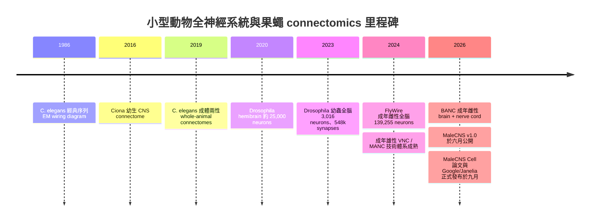

# Google MaleCNS 雄性果蠅全中樞連結組：TechNews 報導與原始研究深度評析

## 執行摘要

TechNews 於 2026 年 9 月 9 日報導的核心科學事件是真實且重要的：Google Research、HHMI Janelia、劍橋大學與 MRC Laboratory of Molecular Biology 等團隊，於 2026 年 9 月 3 日正式發表成年雄性黑腹果蠅（*Drosophila melanogaster*）完整中樞神經系統連結組 MaleCNS。主資料集涵蓋中央腦、兩側視葉、完整頸部連接區與腹神經索（ventral nerve cord, VNC），共 **166,691 個神經元、11,691 個細胞類型**；Google 對外以 **約 1.25 億個 synaptic connections** 概括其規模。這是第一個「完成、全面人工校對並註釋」的成年雄性果蠅全 CNS connectome，並使雄、雌成蟲能在突觸解析度進行系統性比較。citeturn11search4turn21view1turn20view2turn24view0

但 TechNews 對製作方法有一個值得更正的簡化：它描述研究者把果蠅「切成數以百萬計的超薄切片，再以電子顯微鏡逐片掃描」。實際 MaleCNS 樣本並非被物理切成數百萬片；研究者先將完整 CNS 取出，以 **hot-knife 切成 66 塊、每塊 20 µm 厚的 slab**，再由七台客製化 **FIB-SEM** 在每塊內以約 **8 nm 等向性步距**連續銑削與成像，最終得到約 **160 teravoxels**。Google 官方文章所稱的「millions of thin slices」是面向一般讀者的 connectomics 概念化說法，不宜當作本實驗的字面 sample-preparation protocol。citeturn11search4turn22view0turn24view0

另一個需要特別釐清的是「1.25 億個突觸連結」。原始研究的自動偵測層級實際報告約 **4,600 萬個 presynaptic T-bars，連到約 3.12 億個 postsynaptic densities（PSDs）**。果蠅突觸常是 polyadic，一個 T-bar 可對多個 postsynaptic partners，因此「presynaptic sites」、「PSDs」、「pre→post contacts」、「neuron-to-neuron graph edges」與 Google 宣傳中的「synaptic connections」不是同一計數單位，不能直接互換。citeturn24search0turn24view0

本研究最大的科學價值不只是「神經元很多」，而是完整保留了 **brain–neck–VNC 的連續路徑**，因此可以從眼、觸角、味覺等感覺輸入一路追蹤至下降神經元、VNC 與運動輸出。雄、雌比較顯示 **7,205 個 isomorphic、114 個 sexually dimorphic、262 個雄性特有、69 個雌性特有細胞類型**；兩性差異尤其集中在高階整合區，而周邊感覺與運動系統大多較為保守。citeturn21view1turn20view2

然而，「完整 connectome」絕不等於「完整腦功能模型」。作者自己的 quality metric 顯示，全資料集 **connection completeness 約 40.1%**；而雌雄差異主要來自各一隻動物，甚至在 edge-level 統計上把左右半腦當作每一性別的兩個 observations，因此不能把所有差異視為純粹的「性別因果效應」。作者亦明確警告，connectome 是**靜態結構 wiring diagram**，功能推論仍需要生理與行為實驗驗證。citeturn22view2turn22view4turn21view3

TechNews 後半段的 Doom、Super Mario 64 示範則**不是 MaleCNS 論文的研究成果，也不是果蠅大腦已被功能性模擬的證據**。這些是第三方軟體開發者把 connectome 圖結構、人工定義的感覺輸入、節點活動規則與遊戲控制映射組合起來的實驗性展示。它們證明的是「公開 connectome 很容易被拿來做計算實驗」，而不是「一隻數位果蠅以生物學上可信的神經動力學學會玩 Doom」。TechNews 本身並未充分做出這個區分。citeturn11search4turn21view3

最後，Google 所稱「largest brain map by number of neurons to date」也有定義上的問題。2026 年已發表的雌性 **BANC** 全 CNS 資料庫目前報告約 **188,000 neurons、199 million predicted synapses**，原始數量其實高於 MaleCNS；MaleCNS 更精確、較不具爭議的定位是「目前最完整、完成全面 proofreading/annotation 的雄性果蠅 CNS connectome」之一，而非在任何計數口徑下都無條件是最大的 connectome。citeturn24view0turn19view1

## TechNews 報導的主張、圖像與未說明之處

[TechNews 原文〈Google 耗時十年釋出史上最完整果蠅腦圖，開源後秒被拿去玩遊戲〉](https://technews.tw/2026/09/09/google-maps-entire-brain-and-central-nervous-system-of-adult-male-fruit-fly/) 的主線大致忠實跟隨 Google 官方發布與二手科技媒體，但將「原始研究結果」「Google 對外說明」和「第三方遊戲實驗」揉在同一敘事中，因此容易讓讀者高估 connectome 已具備的功能模擬能力。citeturn11search4turn24view0

| TechNews 主張 | 原始來源核對 | 評價 |
|---|---|---|
| 共 166,691 個神經元、約 11,700 種細胞類型、約 1.25 億突觸連結 | 論文為 166,691 neurons、11,691 types；Google 使用 125 million synaptic connections。citeturn21view1turn24view0 | 前兩者精確；1.25 億須註明計數口徑。 |
| 大腦與 VNC 都包含在同一圖譜 | 正確，而且保有 brain–neck–VNC 的連續性。citeturn20view2turn22view0 | 這其實是研究最重要的進步之一。 |
| 「切成數以百萬計超薄切片」 | MaleCNS 實驗是 66 塊 20 µm hot-knife slabs，再於 FIB-SEM 內以約 8 nm 層層銑削。citeturn22view0 | **字面上不準確**；把一般 connectomics 說明誤套成具體 protocol。 |
| AI 將二維 EM 影像重建成三維神經元 | 大方向正確；Google 長期使用 flood-filling-network 類方法，MaleCNS 的正式 pipeline 還包含 semantic segmentation、跨 volume stitching、自動 synapse detection 與大量人工 proofreading。citeturn23view0turn24view0 | 過度簡化，AI 並未消除人工校正。 |
| 人工校對約 44 person-years | 論文估算 29 名 expert proofreaders、三年，合計約 44 person-years。citeturn23view1turn22view2 | 正確。 |
| 專案耗時約十年 | Google 稱正式成果是 decade-long partnership。citeturn24view0 | 合理，但不是十年都在同一階段處理這一顆 CNS。 |
| 開源後被拿去跑 Doom、Mario | TechNews 報導的是獨立開發者實驗，而非 Cell 論文的 validation。citeturn11search4 | **應與科學結果明確切割。** |

TechNews 所用視覺素材主要是 Google/Janelia 的 MaleCNS 三維 render、細胞類型影片與遊戲展示，而不是用來評估 segmentation error、synapse precision/recall 或 statistical uncertainty 的科學圖表。Google 官方的 CNS 區域示意圖則清楚區分 central brain、optic lobes 與 VNC。citeturn24view0turn20view2

**TechNews 幾乎沒有明列科學限制。**至少以下幾點在新聞稿中沒有得到足夠說明：這是單一雄性 specimen；connectome 是 structural 而不是 functional；雌雄比較缺乏獨立個體重複；connection completeness 並非 100%；突觸與 neurotransmitter 是演算法推定後再經不同程度驗證；「1.25 億」與原論文各種 synapse counts 採不同口徑；以及遊戲 demo 不構成功能性 whole-brain emulation。這些限制在原始論文中反而有相當明確的討論。citeturn21view3turn22view2turn22view4

## 原始研究與實驗方法

正式論文為 Berg 等人的 **“Sexual dimorphism in the complete connectome of the Drosophila male central nervous system”**，2026 年 9 月 3 日刊於 *Cell*；其前身 bioRxiv v2 於 2025 年 10 月 30 日公開，MaleCNS v1.0 則在 2026 年 6 月 8 日釋出。Janelia 的官方時間線確認了這三個階段，因此使用資料時最好明示版本，不宜把 2025 preprint、2026 v1.0 與 Cell version 混稱為同一 release。citeturn20view2turn20view3turn13search2

**主要原始來源：**

- [Cell 正式論文 DOI](https://doi.org/10.1016/j.cell.2026.08.015)；正式發表日期為 2026-09-03。citeturn13search2turn20view2
- [可全文檢索的作者稿／預印本版本（PMC）](https://pmc.ncbi.nlm.nih.gov/articles/PMC12636603/)，方法細節最容易核對。citeturn20view4
- [Google Research 官方發布](https://research.google/blog/a-connectomics-milestone-mapping-the-complete-male-fruit-fly-brain/)。citeturn24view0
- [HHMI Janelia Male CNS project](https://www.janelia.org/project-team/flyem/male-cns-connectome) 與 [MaleCNS 資料入口](https://male-cns.janelia.org/)。citeturn20view2turn20view3

實驗的 specimen selection 比新聞報導嚴格得多。研究人員從 **數百隻五日齡雄蠅**中解剖出包含 brain、VNC 與脆弱 neck connective 的完整 CNS；經固定、重金屬染色與初步檢視後，再以 X-ray CT 詳細檢查 44 個候選樣本，最後選定內部編號 **Z0720–07m**。這種「挑最佳保存 specimen」做法有利於重建品質，但也表示資料並非族群中的隨機代表。citeturn22view0

成像流程如下：

```mermaid
flowchart LR
    A[五日齡雄蠅<br/>完整 CNS 解剖] --> B[固定、重金屬染色<br/>X-ray CT 篩選]
    B --> C[選定 Z0720–07m]
    C --> D[Hot-knife<br/>66 塊 × 20 µm]
    D --> E[7 台 FIB-SEM<br/>約 8 nm 等向性成像]
    E --> F[160 teravoxels<br/>多 volume 對位與 stitching]
    F --> G[自動神經元 segmentation<br/>+ semantic masks]
    G --> H[T-bar / PSD<br/>突觸自動偵測]
    H --> I[人工 proofreading<br/>+ AutoProof]
    I --> J[細胞型、NT、fru/dsx<br/>與跨資料集 annotation]
    J --> K[MaleCNS v1.0<br/>NeuPrint / Neuroglancer / downloads]
```

VNC 被切成 31 塊 transverse slabs，brain 則切成 35 塊 sagittal slabs，共 66 塊。七台客製 FIB-SEM 約運作一年：SEM 以約 8 nm in-plane sampling 拍攝，FIB 同樣以 nominal 8 nm 步距銑削，因此最終 voxel 接近 **8 × 8 × 8 nm isotropic**。整體影像約 **160 teravoxels、0.082 mm³**，其中約 0.054 mm³ 為 tissue。citeturn22view0

Brain 和 VNC 原本是分別 section、alignment 的 volume，最後在 neck connective 處拼接。由於兩組切片方向近乎正交，界面仍有約 25° 的幾何差，作者建立 non-rigid transformation，在 BigDataViewer 中人工確認，再把變形限制在頸部附近。這是高明的工程解法，但也代表頸部幾何不是完全「原始無變形」；跨 stitching plane 的微細形態分析需比 volume 內部稍更謹慎。citeturn22view0turn23view0

神經元 segmentation 採用與 MANC／同 specimen 視葉研究相承的自動管線，Google 官方把其核心技術脈絡描述為 **flood-filling networks（FFNs）**。MaleCNS 因影像分成左半腦、右半腦及 nerve cord 三個 subvolumes，segmentation 分三次進行，再於 overlap 區域 agglomerate；VNC 還另訓練 semantic segmentation model，以避免把 muscle 與 nerve cord 混在一起。citeturn23view0turn24view0

突觸分析並不是單一分類器：pipeline 分別偵測 presynaptic **T-bar** 與 postsynaptic partners。原始輸出約有 **4,600 萬 T-bars 與 3.12 億 PSDs**。驗證集涵蓋 brain 與 VNC 多個 ROI；作者報告 T-bar recall 一般高於 0.8、完整 synapse unit recall 多在 0.7 以上，並針對 lamina 等較差區域重新 fine-tune detector。這說明「整張圖都有同樣偵測率」並不成立。citeturn24search0turn22view1

Neurotransmitter 推定則是另一層 ML。作者用既有實驗資料建立 ground truth，訓練 **ResNet-50** 影像分類器，輸入以 T-bar 為中心的局部 EM volume；訓練／驗證 neuron split 為 80/20，100,000 個 mini-batches、batch size 32，使用 AdamW，並加入 geometric、intensity、noise 與 smoothing augmentation。模型處理七種主要 neurotransmitter；若 cell 的 presynapse 太少或 confidence <0.5，就標為 `unclear`。由於 octopamine 與 serotonin 的驗證資料不足，官方推薦的 `consensusNt` 甚至把兩者統一保守標為 unclear。citeturn22view1turn23view1

真正昂貴的步驟仍然是人工 proofreading。29 名專業 annotators 花約三年、估計 **44 person-years**；所有初始 segmentation 中具有 >100 synaptic connections 的 fragment 都被納入優先校對。最後 141,780 個 neuron-associated nuclei 中 **98.9%** 已與 proofread neuron 相連。另有一套從人工 merge decision 學習的 **AutoProof** 處理較小 orphan fragments，以約 3% 預估錯誤率的保守 threshold 自動接受約 20 萬個 merges，加入約 240 萬 PSD、30.9 萬 T-bars，提高約 1.3 個百分點的 connectivity completion，相當於節省約四個 person-years。citeturn22view2

## 資料規模、驗證與可重現性

MaleCNS 的「完整」需要分層理解。

在**細胞／主幹重建層次**，研究團隊有充分理由稱它為 finished connectome：166,691 neurons 被系統性 proofreading、typing 與 annotation，超過 95% 神經元可連回既有細胞型或功能文獻，且 brain 與 VNC 連成同一 CNS。citeturn21view1turn22view5

但在**每一個微小 neurite 與每一個 pre→post contact 都被雙方完整 traced**的層次，就不是 100%。作者將「pre 與 post 兩側都屬於 traced neuron」定義為 connection completeness，全資料集平均只有 **40.1%**。這主要是因為細小 postsynaptic processes 遠比大型 presynaptic neurites 難以完整重建。因此「fully proofread」不能翻譯成「三億多個 PSD 全部由人逐一確認、且全部成功接回完整 neuron」。citeturn22view2

這也解釋了幾組看似互相矛盾的數字：

| 層次 | 數量 | 正確解讀 |
|---|---:|---|
| 神經元 | 166,691 | finished dataset 中的 neurons。citeturn21view1 |
| 細胞類型 | 11,691 | 作者的 type annotation。citeturn21view1 |
| Presynaptic T-bars | 約 46 million | 自動偵測的 presynaptic structures。citeturn24search0 |
| Postsynaptic densities | 約 312 million | 與 T-bars 關聯的 PSD detections；一個 T-bar 可對多個 PSD。citeturn24search0 |
| Google「synaptic connections」 | 約 125 million | 對外發布使用的另一個 completed/graph-level 計數口徑，不應與 PSD 數直接相比。citeturn24view0 |
| Connection completeness | 40.1% | pre 與 post 兩端都能落到 traced neurons 的比例。citeturn22view2 |

因此，**「125 million」不是「論文只有看到 1.25 億突觸，而另一處又看到 3.12 億」的矛盾；它主要反映 connectomics 中不同層級的計數定義。**

可重現性方面，此計畫的表現相當強。作者明確提供 static primary data bucket `gs://flyem-male-cns`，MaleCNS portal 可查 cell types、connectivity、synapses、skeletons、images；資料可經 neuPrint、Clio、Cell Type Explorer、Neuroglancer 或程式介面存取，並採 **CC-BY**。citeturn21view3turn20view2turn20view3

主要可重現資源包括：

| 資源 | 內容 |
|---|---|
| [MaleCNS 官方入口](https://male-cns.janelia.org/) | Explore、Dimorphism Explorer、下載、Gallery。citeturn20view3 |
| [Janelia project page](https://www.janelia.org/project-team/flyem/male-cns-connectome) | NeuPrint、Clio、Cell Type Explorer、standalone Neuroglancer、下載入口。citeturn20view2 |
| [flyconnectome/2025malecns](https://github.com/flyconnectome/2025malecns) | 本論文 derived data 與 figure/source data。作者 Data Availability 明列此 repo。citeturn21view3 |
| [flyconnectome/flywire_annotations](https://github.com/flyconnectome/flywire_annotations) | 用於雄／雌 cross-dataset 比較的更新 FlyWire annotations。citeturn21view3 |
| [flyconnectome/malecns](https://github.com/flyconnectome/malecns) | R 端處理 MaleCNS segmentation、mesh、annotation 的工具。citeturn22view3 |
| neuprint-python / natverse / navis | 官方方法表列出的 open analysis ecosystem。citeturn22view3 |

**值得直接看的原始視覺化：** [Janelia MaleCNS project page](https://www.janelia.org/project-team/flyem/male-cns-connectome) 在「Getting Started」提供 standalone **Neuroglancer**，可同時查看原始 image layers、segmentation、synapses、neuropil compartments，以及對位後的雌性 neuron meshes；[MaleCNS Gallery](https://male-cns.janelia.org/gallery) 則是較容易瀏覽的影像／影片入口。citeturn20view2turn20view3

Google 官方也提供一張非常適合作為論文／文章示意圖的 CNS schematic，明確標出 **central brain、optic lobes、VNC**，以及 MaleCNS 三維 render；可從 [Google Research 官方文章](https://research.google/blog/a-connectomics-milestone-mapping-the-complete-male-fruit-fly-brain/) 查看原圖。citeturn24view0

不過「資料開放」仍不等於 end-to-end 一鍵重建。此次可確認公開的項目包括 image volumes、segmentation/annotations、connectivity、分析 code 與多個 client packages；但主論文的 Data Availability **沒有承諾把每一代 segmentation/synapse model checkpoint、完整分散式運算環境，以及 44 person-years 的所有人工決策都包成可從 raw EM bit-for-bit 重建 v1.0 的 workflow**。因此科學分析具有高度可重現性，但整個 connectome-production process 的完全再製成本仍極高。citeturn21view3turn22view3

另外，Google 在同一官方文章提到利用 synthetic neurons 改進 **PATHFINDER** 的新方法。這是 connectomics segmentation 技術發展的重要後續，但**不能倒推成 MaleCNS 全資料集就是由 PATHFINDER 製作**；MaleCNS 使用的是多年演化的 segmentation pipeline，Google 的 PATHFINDER 敘述屬未來／新一代方法脈絡。citeturn24view0

Google 亦連結三篇使用 MaleCNS 的 companion studies，主題分別為視覺、味覺及社會行為。此次檢索可明確定位到視覺系統的 *The organization of visual pathways in the Drosophila brain*，以及 *The complete gustatory connectome of adult Drosophila*；Google 官方頁面是三篇 DOI 的可靠統一入口。社會行為 companion paper 的標題在此次可存取搜尋索引中沒有穩定解析，因此不在此猜測題名。citeturn12search0turn13search21turn24view0

## 與先前全腦與全中樞連結組的比較

真正理解 MaleCNS 的意義，關鍵不是只跟「過去最大數字」比較，而是看 coverage、解析度、proofreading 程度、sex/age 與是否保留 brain–cord continuity。

| 資料集／物種 | 年齡／性別 | Coverage | EM / 解析度 | 神經元 | 突觸或連結 | 年份 | 資料可用性 |
|---|---|---|---|---:|---:|---:|---|
| *C. elegans* whole-animal, Cook et al. | 成人；hermaphrodite 與 male | 全神經系統 | legacy serial-section EM；多個歷史 specimen | 約 302（herm.）；male 約 385，依 sex-specific neuron 定義而異 | chemical / gap-junction 計數受 contact、section-weighting 定義影響；本次來源未提供適合直接與果蠅「synapse count」比較的單一值 | 2019 | 公開；完整兩性 wiring diagrams。citeturn17search1turn17search5 |
| *Ciona intestinalis* tadpole | 幼生；性別不適用／未指定 | CNS | serial-section EM，約 60 nm sections | 177 CNS neurons | 6,618 chemical synapses（>1 section），另 1,206 putative gap junctions（>1 section） | 2016 | eLife 全文與 source data 公開。citeturn16search2 |
| *Drosophila* larval brain, Winding et al. | 幼蟲；性別在研究主體中非主要變數 | 完整幼蟲 brain/CNS circuitry | serial EM | 3,016 | 548,000 | 2023 | 公開；Science 論文與 connectome resources。citeturn16search1 |
| Hemibrain | 成年雌性 | 約半個中央腦＋相關區域；**非全腦** | FIB-SEM；約 8 nm 等向性技術世代 | 約 25,000 | 約 20–21 million connections | 2020 | neuPrint 等公開。citeturn24search2turn24view0 |
| FlyWire / FAFB adult brain | 成年雌性 | 完整 brain；不含完整 VNC | ssTEM，非等向性 | **139,255** | **54.5 million synapses** | 2024 | FlyWire/Codex 等公開。citeturn24search1 |
| BANC | 成年雌性 | brain + neck + 完整 VNC | serial-section EM；**4 nm in-plane** | 約 **188,000** | 約 **199 million predicted synapses** | 2026 | Nature、Harvard Dataverse、Codex、Neuroglancer，分析 repo 公開。citeturn19view1turn18search0 |
| **MaleCNS** | **5 日齡成年雄性** | **brain + optic lobes + intact neck + VNC** | **FIB-SEM，8×8×8 nm isotropic** | **166,691** | Google：**125m connections**；detector：46m T-bars / 312m PSDs | **2026** | **CC-BY；影像、connectivity、annotations、NeuPrint/Neuroglancer、code 公開**。citeturn22view0turn21view1turn24search0turn20view2 |

這張表也揭示一個重要語義問題：**「最大」與「最完整」不是同義詞。** BANC 的目前 neuron/predicted-synapse 數量高於 MaleCNS；MaleCNS 的突出之處則是 8 nm 等向性 FIB-SEM、完整雄性 CNS、密集專家 proofreading、成熟的 type annotation，以及可和既有雌性 brain connectome 做細胞型對細胞型比較。citeturn19view1turn20view2turn24view0

相關里程碑可概括如下：

其中最關鍵的歷史轉折是：2020 hemibrain 證明約兩萬多神經元規模可以做到高品質人工驗證；2024 FlyWire 把 coverage 推到完整 adult brain；2026 BANC 與 MaleCNS 則跨過頸部，把 brain 和 VNC 放進同一個 synaptic graph。citeturn24search2turn24search1turn19view1turn20view2

## 批判性評估與替代解釋

**最強之處是成像品質與 anatomical continuity 的組合。** 8 nm 等向性 FIB-SEM 避免 ssTEM 常見的大 z-axis anisotropy，66 個 slabs 雖仍需 stitching，但 slab 內細小 neurites 可在三個方向以相近尺度追蹤；再加上 intact neck，使視覺、嗅覺、聽覺、味覺等 circuit 能真正跨 brain–VNC 連成 sensorimotor pathway。citeturn22view0turn20view2

**第二個強項是 human-in-the-loop 的規模。** 44 person-years 並非單純補幾個 segmentation mistakes，而是把 automated volume reconstruction 轉成能依 cell type 查詢與比較的 biological atlas。98.9% neuron-associated nuclei 已接到 proofread neurons，加上 typing 階段由神經解剖學家再次看 reconstruction，讓大型 merge/split errors 比純自動 connectome 更容易被發現。citeturn22view2turn23view1

**但「finished」仍是 connectomics 的技術性詞彙。** Connection completeness 只有 40.1%，代表大量小 neurite/PSD 沒有形成「兩端都完整 traced」的有效 connection。這不是研究失敗——大型 EM connectome 本來就有這種長尾問題——但它限制了「缺少一條弱連線」的解釋力：absence of an edge 並不總等於 biological absence。citeturn22view2

**最大的生物統計問題是樣本數。** MaleCNS 本質上是**一隻五日齡雄蠅**的 snapshot；主要雌性比較也高度依賴一隻 FlyWire female brain。作者在 edge dimorphism analysis 中把左右 hemisphere 當成 male 的 n=2、female 的 n=2，使用 t-statistic 與 Benjamini–Hochberg FDR。這可以利用左右對稱來估量 connectivity noise，卻不是四隻獨立動物的 biological replication。citeturn22view0turn22view4

這點尤其重要，因為雄、雌 datasets 之間存在系統性 synapse-count 差異，作者必須把 MaleCNS edge weights 整體乘上 **0.581 scaling factor** 才進行比較。此外，為取得約 90% 的跨資料集 edge reproducibility，作者對弱連線設 threshold；約 **80% 的 cross-matched edges** 落在不可靠範圍以下，只是這些弱 edges 合計只承載約一成 synapses。因此「大量弱 edge 有雌雄不同」的說法遠不如「強 circuit motifs 或 cell-type-level differences 有雌雄不同」可信。citeturn22view4

換句話說，論文找到的 114 dimorphic、262 male-specific types 是非常有價值的候選生物學差異，但某一條 A→B edge 的 synapse count 差異可以有至少四種替代解釋：真正的 sex difference、個體差異、sample/preparation 差異、或 segmentation/synapse-detection 差異。作者自己因此主張，直接比較兩個 raw connectome graphs 並不足夠，應依賴 cell-type matching、bilateral consistency、edge-strength thresholds 與未來多 specimen replication。citeturn21view3turn22view5

另一個 artifact 來源是 **hot-knife boundary 與 neck stitching**。研究者必須使用 non-rigid transform 補償約 25° 的切面差，且三個 segmentation subvolumes 分別生成後再 agglomerate。這種方法非常合理，但若研究問題恰好落在 slab boundary 或 neck interface 的極細 neurite morphology，就應回到原始 EM volume 人工確認，而不是只信 skeleton coordinates。citeturn22view0turn23view0

Neurotransmitter annotation 也應視為 probabilistic layer，而非 EM 直接「看到」化學物質。模型可從 ultrastructure 學到 transmitter-correlated features，但仍依賴 cell-type ground truth，對低 synapse-count cells 設 `unclear`，且 serotonin/octopamine 因驗證不足被保守撤回。因此用 `predictedNt` 建立 excitatory/inhibitory functional simulation 時，應優先用作者推薦的 `consensusNt`，並保留 uncertainty。citeturn22view1turn23view1

對「sex differences 集中於 higher brain centres」也有兩層解讀。生物學上，這與 fruitless/doublesex、courtship/auditory/visual circuit 的既有知識相符，且作者找到具體 circuit switches；但方法學上，高階區域也是 cell-type annotation、cross-dataset matching 與 dimorphism analysis 最深入之處。因而更保守的表述是：**目前資料強烈支持雄雌差異主要集中於高階整合 circuit，但尚不能由單一雌、雄 specimen 精確估算這一規律在族群中的 effect size。**citeturn20view2turn21view2turn21view3

最後，connectome 本身並不包含神經元膜電位、ion-channel kinetics、短期／長期突觸可塑性、神經調質濃度、內分泌狀態或身體與環境的 closed-loop dynamics。作者明確寫道，它提供的是 **structural wiring diagram**，仍需 functional analysis 驗證 information-flow predictions。這正是為什麼 Doom/Mario demo 不應被解讀成「果蠅意識已上傳」或「完整果蠅腦已成功仿真」。citeturn21view3

## 潛在應用與倫理考量

近期最可信的應用是**產生可實驗驗證的 circuit hypotheses**。研究者可從特定 sensory neurons 出發，找出 ascending/descending pathways、VNC motor targets，再利用果蠅成熟的 genetic driver、optogenetics、calcium imaging 或 electrophysiology 驗證。這比過去只看中央腦或只看 VNC 更接近真正的 perception-to-action circuit analysis。citeturn21view1turn20view2

第二個方向是**比較連結組學**。現在已有 FlyWire female brain、BANC female CNS、MANC male VNC 與 MaleCNS male CNS，研究者可以區分哪些 cell types 高度 stereotyped、哪些 connectivity 對性別、個體或 experience 敏感。MaleCNS 作者已展示 AOTU、auditory、courtship、taste 等 circuit 中的 sex-specific switches，但更重要的下一步是增加 biological replicates。citeturn24search1turn19view1turn21view2turn21view3

第三是**計算神經科學與 whole-network simulation**。Connectome 能提供拓撲、synapse counts、部分 transmitter sign，以及 cell-type annotation，足以限制模型的結構自由度；但 dynamics、gain、time constants、neuromodulation 等仍需額外量測或假設。因此真正有說服力的模擬應把「由 EM 測得的參數」和「模型自行假定的參數」逐項分開，而不是以能否控制遊戲角色當作 biological fidelity 指標。這也正是作者強調 functional validation 的原因。citeturn21view3

Google 提到未來 pharmacy、medicine、腦疾病乃至 brain repair，這些應視為**長期技術願景，不是 MaleCNS 已證明的醫療應用**。果蠅 connectome 的直接價值在揭示 neural circuit design principles、提供基因／細胞層級實驗導航，以及改進更大型 connectome 的 AI pipeline；從果蠅結構直接推論 Alzheimer’s、depression 或 schizophrenia 的療法，仍有非常長的跨物種與功能驗證鏈。citeturn24view0

倫理面目前不像人類 connectomics 涉及高度個人隱私，但仍有三個值得提前處理的問題。第一是**過度擬人化與媒體誤導**：把 structural graph 的遊戲 mapping 稱為「果蠅大腦玩 Doom」會模糊模型假設與生物實證之間的界線。第二是**open-data provenance 與 credit**：MaleCNS 採 CC-BY，後續商業／AI 使用理應保留資料來源與大規模 annotation labor 的署名。citeturn20view2turn21view3 第三是技術向脊椎動物乃至人類發展後，神經資料的 consent、identifiability、心理特徵推論與「digital reconstruction 是否代表個體」等問題會變得更實質；MaleCNS 本身尚未跨到這一倫理門檻，但今天對「connectome ≠ mind」的概念界線，會影響未來如何處理更複雜資料。

## 方法附錄與不確定性

本報告以 **primary-first** 策略檢索。首先核對 TechNews 原文及其 2026-09-09 發布內容；接著以 Google Research 2026-09-03 官方文章及 HHMI Janelia MaleCNS project/release notes 確認新聞中的數字、日期與官方定位；再以 *Cell* 正式論文 DOI、作者可全文檢索版本的 Methods/Data Availability，逐項查 sample preparation、FIB-SEM acquisition、alignment、segmentation、synapse detection、neurotransmitter prediction、proofreading、statistics 與 limitations。最後再以 FlyWire *Nature*、BANC *Nature*/官方 repository、hemibrain *eLife*、Drosophila larva *Science*、*Ciona* *eLife* 及 *C. elegans* whole-animal connectome 作歷史比較。citeturn24view0turn20view2turn20view4turn24search1turn19view1turn24search2turn16search1turn16search2turn17search1

比較時特別避免把不同研究中的「synapse」強行當成同一單位：果蠅資料可以報 T-bars、PSDs、pre→post contacts、weighted neuron edges 或 thresholded graph connections；*C. elegans* 等早期 serial-section datasets 又常以 synaptic contacts、section counts 或 anatomical weights 表示。這也是本報告沒有替所有舊資料集硬湊出一個看似精確、實際不可比的單一 synapse 數的原因。citeturn24search0turn16search2

仍有幾項**明確不確定或未指定**：

第一，TechNews 沒有清楚定義「1.25 億 synaptic connections」的精確 database-level counting rule；Google 也在對外文章使用此概括數，而原論文同時報告 46m T-bars 與 312m PSDs。因此本報告不把 125m 擅自等同其中任何一者。citeturn24view0turn24search0

第二，Google 官方對「largest brain map by number of neurons」的稱法與當前 BANC 約 188k neurons 的 public repository 數字表面上不一致。最合理的解讀是 Google 把「finished / fully proofread and annotated」納入定義，但官方段落本身沒有把這個 qualifier 說得足夠明確，因此應視為宣傳性 headline，而非無條件的資料庫排序結論。citeturn24view0turn19view1

第三，Cell 正式版已於 2026-09-03 發表；本報告的細節方法核對主要使用可全文檢索的作者稿／預印本內容，再以 Janelia 與 Cell/Google 的正式發布資訊確認 publication status。未逐字逐表比較 Cell 排版版與 preprint v2 的所有細微版本差異；若某一參數需要作實驗 replication，應以 Cell version of record 及 MaleCNS v1.0 release notes 為最後準據。citeturn13search2turn20view2turn20view4

第四，Google 官方頁面確實連結三篇同期 companion papers，分別討論 visual systems、taste 與 social behavior；此次搜尋可可靠解析前兩者題名，但 social-behavior DOI 的題名未由可存取索引穩定回傳，因此此處刻意標為**未指定**，而不以推測補齊。citeturn24view0turn12search0turn13search21

整體而言，TechNews 捕捉到了事件的重要性，但最值得寫進更嚴謹文章的核心並不是「AI 把果蠅腦掃完、然後可以玩 Doom」，而是：**一個 160-teravoxel、8-nm-isotropic 的完整成年雄性 CNS，經數十人年 human proofreading 後成為可公開查詢的 cell-type-resolved wiring atlas；它首次使成年果蠅兩性的大尺度 comparative connectomics 與完整 sensory-to-motor tracing 真正可行，同時也非常清楚地暴露了 connectomics 目前的邊界——單 specimen、connection incompleteness，以及結構圖譜與神經功能之間仍然存在的巨大缺口。** citeturn22view0turn22view2turn21view3